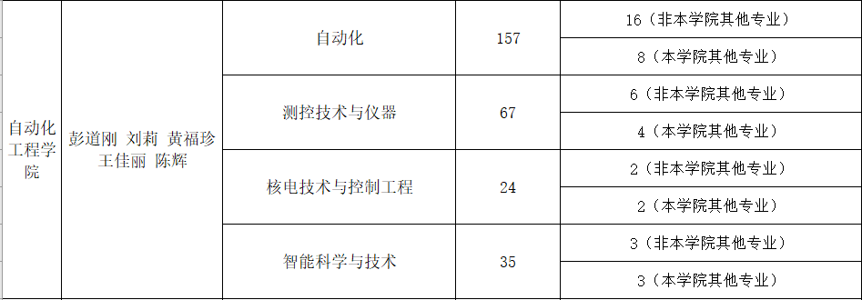

# 21级光电转智能科学专业 

### 转专业的前提：
【1】跨学院转专业需要到达专业的前10%才有资格转专业
【2】上下学期都没有挂科，哪怕是选修课也不可以
【3】没有违反校规校纪受到处分
首先这边有个小提示：学院所说的按照计划录取多少人其实并不是真的就按照上面的录取

 
例如这个表格里面所说，自动化跨学院的只能招16人，实际上是可以招到23人，其他专业的名额就被安排成了自动化专业，我是因为自身不太想选自动化所以没有去竞争，选择了去智能科学与技术这个专业。在报转专业的时候，只要你出现在复试的名单之上基本上就可以进了，面试的话只不过是一个流程，哪怕你讲的再烂，其实并没有什么太大的关系。（PS：虽然话是这么说的但是你真的不要真的摆烂，出了事情玩大发了我可不负责任。）

### 面试问题的准备：
想必大家都是第一次经历面试难免会非常的紧张甚至是不知所措，不知道老师要问什么，不知道怎么回答，更不知道怎么以一种轻松自信的态度展现给老师，其实要做到轻松自信，你就得要先把稿子准备好，把问题准备好。

 
记住，面试的时候要不要眼神东看看西瞅瞅，看着老师就行。提醒自己保持smile就好了，没有什么更多的要求了。

 

### 记住！
### 自信和笑容是最重要的！！！！
