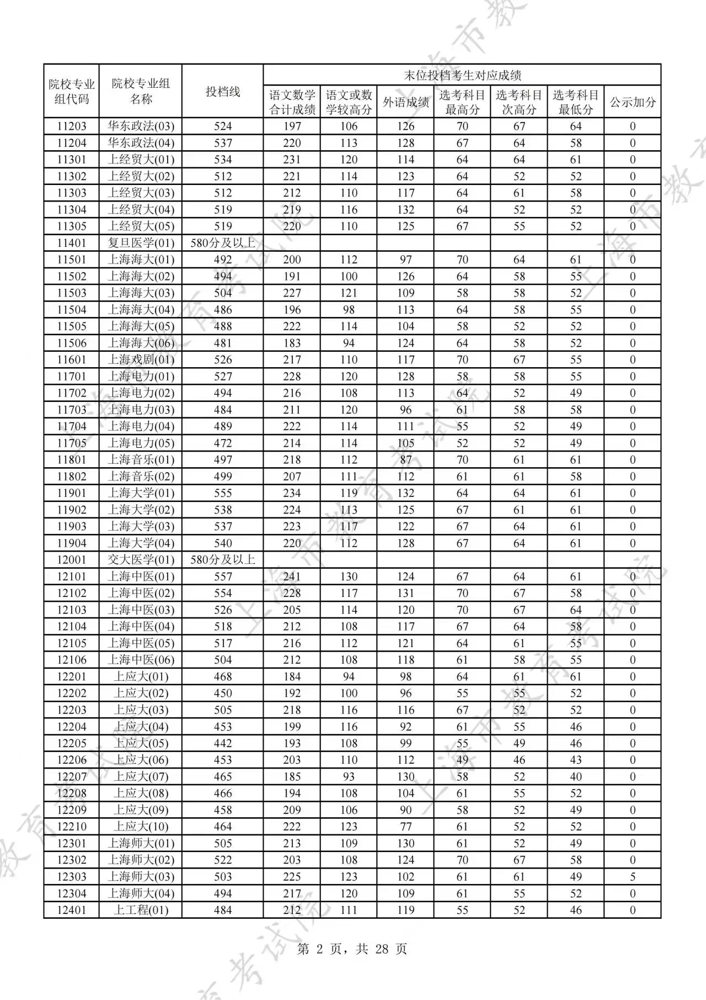
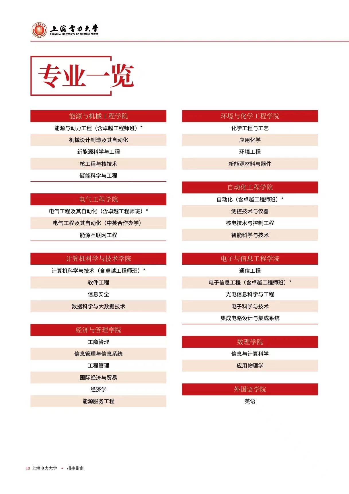

# 学校介绍

from 猫柒

## 我妈想让我报上海交通大学，但是

上海电力大学是中央与上海市共建、以上海市管理为主的全日制普通高等院校。学校创建于1951年，1985年1月升格为本科，更名为上海电力学院，2018年12月，经教育部批准更名为上海电力大学。学校现有杨浦、浦东两个校区，全日制在校生一万四千余人，教职工一千余人。

学校的校训是“爱国、勤学、务实、奋进”，学校坚持“立足电力、立足应用、立足一线”的办学方针，树立“务实致用，明理致远”的办学理念。学校坚持深化改革，加快内涵建设，办学规模、办学层次、办学质量和国际影响力稳步提升，逐步发展成为以工为主，兼有理、管、经、文等学科，主干学科能源电力特色鲜明、多学科协调发展的高等学校。

我妈听了之后泪流满面，说孩子咱还是报考上海电力大学。

## 正经的

上海电力大学最出名的大抵就是“原电力部直属”名头，电力部直属学校还有很多，但是华电211自有大儒为我辩经，东北电力地处东北大家不太愿意去，其他直属要么没升大学，要么像三峡大学走综合路线。上海电力大学就从一堆电力部直属中脱颖而出，又是上海，国网内部评价是很好的，加之近几年理工科逐渐上位，学校王牌也是电气能动自动化，自然名气逐渐上升。分数线在上海以外的地区也是嘎嘎涨，在上海因为历史上的电力学院还没过去多久，上海人多少仍然认为上电是和应技大工程大差不多档次的二本，但是写这篇文档的24年，上电在上海的分数线也已经遥遥领先于应技大工程大，甚至领先隔壁双一流的海洋大学。上电最强的可以说就是这个分数线了，然后是电气。贴个24年分数线看看：

## 学校定位

这里说的是整体定位，不代表所有专业。
报志愿不能看分数线大家大抵是再清楚不过了，学校的分数线和地区与风评关系还是很大的，所以总体而言上海的学校对外地人来说性价比都是很低的，哪怕是上海老二本在外地的分数也是一本线上四五十分。所以上海的学校分数高很大程度上是上海这个地域的原因。就学校实力而言，除去4个9和4个2以外，在上电以上的有上科 上理 上外贸 华政 上师 上中医 上海事 上海洋(待定)，海洋虽然双一流但是农业类，如果想学理工专业的话还是尼电好一点。上师上中医不是一个赛道，但上海市给的资源还是多一点，其他音乐学院戏剧学院什么的赛道差的就更远了，就不算在内了，一般高考也不会去看。

对自己有个清晰的定位，在入校后进行规划更好一些。

## 专业介绍

先看看所有专业

尼电专业特点是经常砍专业，24年又砍掉了物流材料网工日语四个专业，所以其实专业质量还是挺高的，但当然也可能你自己的专业读着读着给没了。我想按照学院来讲，因为一个学院学的东西其实都差不多。

### 电气学院

尼电最好的自然是电气，在上理电气和尼电电气中选一个，我会推荐你选上电电气，对于电气要有足够的自信，进了电气就不要觉得自己学校档次不行，倘若将来就业不好应该只有两种可能：一是电气整体行业不行，二是你自己学的不行。同在电气专业的还有能源互联网，就业可以参考东电智能电网专业。电气分班之类的并不重要，只是课程略有不同，有精英卓越普通三种类型。精英考研，卓越就业。硕士和博士都有。
电气还有一个中外合办，模式是中外4+0和2+2任选，不强制出国，好像南工程是强制出国的，尼电在这方面还很人性化。同时就目前而言，毕业证之类的证书和普通的电气是一样的，非常的好。学费一年21000，给自己提点分读个好专业，还是挺值的，当然出国就得二三十万了。不过要注意的是中外进了就没办法转专业了，如果有特殊需求的话慎重。

至于就业，国网是有优待的，但具体招聘每个地方都不太一样，本科生进电网也是需要努努力的，毕竟还有研究生在竞争。进电网比例什么的招生办也不会透露，不用天天打那个打不进去的招生办电话问。但是注意本科生没有上海户口是进不了上海电网的，研究生才有机会进，如果家里是电网的对这方面应该比较清楚，问招生办还是问学长都不如问问你爸。

能源互联网和电气中外在某些省份是不招生的，以本省报考指南为准。

### 能源与机械学院

在本校的招生简章手册里，能机学院放在了第一个介绍，所以很多家长都喜欢打能机的电话，我也不知道为什么能机要放在第一个，难道能机要扩招吗？我不清楚。

能机里的能源与动力工程是国家特色专业，专门进电厂，家里是电厂的又报不上电气的可以优先考虑这个。同时因为电气能动机械这三个专业的基础学科建设是一样的，所以能机里的能动和机械也能沾上电气的光。这种传统工科就业怎么样也不太需要我怎么说，因为我也不知道，但是学起来比较省心，跟着学校一步步学就行，因为网上也没有这些学科的资料，这种专业都比较封闭。至于能机学院的其他专业，大抵都差不多，就业方向也就是能源企业电厂这一类，区别不大。

最大的缺点其实是没女生，据我认识的不知名机械专业学生所说，班上50多个人只有1个女生。

### 自动化学院

自动化是学校的又一个国家特色专业，也是进电厂的，只不过好像更偏向计算机控制？这个我就不是很懂了，喜欢玩计算机又觉得计科不好的，可以选择自动化专业，自动化具体学习路线移步手册下方学习指北部分，毕竟我是招生办，不是负责老师。自动化学院其他专业就平常聊天过程中我觉得是一般般的，还是先加几个学长问问再报，或者进来先做职业规划。

### 环化学院

生化环材，今年刚撤销一个材料，最适合读博的学院，无需多言，好处是学院有独占一栋楼防止实验爆炸。前校长就是环化的，博士点应该也已经要有了。

### 计算机学院

尼电的计科和软工学的差不多，技术主要都是Java EE方面的，其他信息安全大数据科学课程设置倒是有一些区别，不过老师都脱产不知道多少年了，上课不听自己网上搜个教程学都比老师讲的好。信息安全应该是个有专升本和中本贯通的专业，图个计算机系身份找工作还是方便一些，我想提到一个名字非常长的专业，其他学院的时候会说。

计院学的东西基本都差不多，尤其是计算机基础内容。什么信息安全数据科学，只是一种方向或者延伸，大概可以说这四个专业的人应该要做到能互通才对。计算机这个东西比较特殊，也是传统工科但没有那么传统。兴盛于互联网，所以网上的计算机学习资料非常多，多到理论上你可以完全脱离学校自学成计算机高手。事实上学校教的计算机知识也相当有限，一个学期把一种语言的基础语法教完不错了，下个学期再学个什么java web，再下个学期学个数据库。课程设置看起来和其他学科一样合理有序，但实际上计算机的学习在入门之后是相当快的，个人经验而言，学完c语言这个入门必备的东西之后再学其他语言也就半个月的时间，就能达到学校一个学期的教学进度。同时也只有在学校课程的基础上大量额外自学才能在毕业的时候找到一个还可以的工作，至少在大二结束的时候学到springboot。学计算机必须要有这种学习速度和自学能力，否则难以跟上业界速度。如果对计算机没有兴趣，只是觉得能赚钱，还是别报，这样进来的话连学校课程也学不懂，找工作也很难。

计算机确实在走下坡，不过土木不也辉煌过吗，将来情况怎么样，反正我不知道，电气就会一直这样受人追捧吗？大概也不会，所以在理工科里选个自己喜欢的读才是最重要的。喜欢计算机的话，学这个没有任何问题，就业在上海也没有太大的问题。

计算机学科除了清华这种顶尖学校教学不错以外，其他学校的校内教学就是一坨，管你是211还是双非还是民办都没什么本质区别，计算机这里学校只剩个牌子，真想学到技术一定要网上大量自学。

### 电子信息学院

电子信息我了解的不多，不过当前主要的方向大概就是光电微电子半导体这些，之前学长也有半导体公司工作的，也有电信移动联通这些运营商，上电电子信息名不见经传的，其实意外的就业和实力还不错，也算是电气弱电方向。个人感觉就是搞搞半导体搞搞硬件，计算机那边主要还是软件。但如果是光电的话，还是去上理光电好。

### 经济与管理学院

我的母院，经管的含金量相比不用多说，不过上电经管也是有点特色在的。首先上电是理工大学，所以经管里的交叉学科都是偏工学的，说的就是信管和能服，这两个一个完全能放到计院，一个完全能放到能机，不太清楚为什么要在经管搞新生心态。其他的工商国贸经济学不建议来上电学这个，倒是女生挺多的。经管专业和上面那些一个学院学的东西大差不差的情况不同，经管的专业还是都很有特色。

首先信管，我就是信管，这就是我要提的名字非常长的专业，学的计算机很多但是不是计算机系，一级学科管理科学与工程(24年之前还有一个管科下属专业叫物流管理，大概是因为就业质量不行被撤了，也能看做是缺乏特点，学物流还是去海事比较好)，授管理学位有点坑，课程学的和软工类似，学到大三会让你自选两种方向安卓开发和电子商务(类似前端开发)，不看成绩自己自由选择。管理类的课听听算了，就当拓展知识面了，信管最好的方向现在就是计算机。所以还是那句话，计算机大量自学就行了。如果想走会计或者其他方向，一定在大一要做好规划，否则信管课程很多都科普性质的，到最后都懂点都不会用就寄中寄了。走计算机方向更要提前规划提前自学，不用多说。

然后能服，全称能源服务工程，一级学科能源与动力，所以我不知道为啥在经管，21年新设立的专业，全国只有四个大学开设，所以按专业评级还是A+多少有点难蚌。24年还没有毕业生所以也不知道就业好不好。肉眼可见大多数都是调剂来的，根本不知道有这个专业，比信管还冷门，很多新生一来看见在经管感觉天都塌了，学了四分之一辈子的理科跑经管来了。但其实不用太害怕，一考定终身的时代已经结束了，能服课程设置也是电气能机类课比重较大的，工科类的东西学的挺多，不能说有能机那么好，但真不至于回去复读，在校把课学好比啥都强。个人感觉偏向供应链，能源电力设施建设之类的方向，进个能源电力类企业应该还是可以的。上电经管的这两个专业感觉不是传统意义上的经管专业，多少和上电本身发展历史原因有些关系，新生不用看见经管就感觉读到文科专业完了，把课程学好也不会有什么天大的问题。

工程管理，土木课程+管理学位，无需多言，建议转专业或者考研跨走。家里有工程类关系或者有相关规划除外。手册后面的考研建议里的同济物理系就出自工程管理。

工商管理，其实这才是老经管正黄旗专业，只不过只有本科专业，混的还不如有管理科学与工程硕士的信管。本科专业评级倒是还算不错，但纯文科也不用多说啥，商科最看关系的一集。工商到大三会分人力资源和财务会计两个方向，自己想选啥选啥不看成绩，其他问题建议去贴吧新生群问有个叫杏仁的群主要点资料或者建议。

国际贸易和经济学都是经济类的，国贸英语要求高点，不过主要特色是有纯外国人班(?)，经济类我不太懂，只知道班里女生很多，工商女生也很多。还有学工商会计还是经济来上电你都不如去立信，别来理工大学学文科商科这是常识。还有最看关系的一集，家里没那个实力还是别学这个了。

以前还有个公共事业管理专业，但是头部跨考了，尾部烂中烂延毕(尼电想延毕都难)，所以19年之后就撤销没了。纯管理，看着课程都感到绝望。

### 数理学院

信息与计算科学纯数学，应物太阳能发电方向。上电基础学科一般，考个研会好一些。很多人把信计当计算机报，看着有点心痛，能不能提前了解一下学校啊。

### 外国语学院

以前还有日语，现在没了，就剩个英专。还是那句话，不要来理工大学学文科商科，英专学习建议详见手册后专业学习指北。

## 常见问题

本人在招生办接了全国整个报考期间的电话，有一些很常见的问题在这里回答一下，不用打那个招生办电话了，一直接真的很累。

### 有没有保研

现在24年，没有保研，不知道什么时候会有。硕博倒是都有了。

### 预科班

不公布分数线，进来学学语数英体和画画之类的素质教育课程，最后按期末考试成绩报专业志愿。专业名单每年不尽相同，但是基本每个学院都会出一两个好的，比如电气能动自动化软工信管能服。
招生办不敢说，但是上电预科班分数其实也能去上大预科班，还是去上大吧。

### 特色专业

客观来讲电气最好，但是电气能动自动化国家特色都好。

### 身体要求

色盲色弱是不能进化学类专业的，电气能动等其他专业没有限制。至于企业招聘有没有限制就不关学校的事了，我也不太清楚。

### 调剂

组内调剂，且只在本省招生专业内调剂。
色盲色弱不会调剂到化学然后退档，因为调剂是人工一个一个看的，不是机器自己调。
服从调剂不会退档，不服从被退档活该，没办法改。

### 我是xx省的，今年分数xx分，排名xx名，报你们学校有希望没有？

自己看去年分数线和排名，自己把握。
一般会涨点，涨多少，把握有多大，我怎么会知道。

### 就业率？考研率？

就业率倒是有官方公众号推文自己看看，但是参考价值不大，因为注册美团骑手成功也是就业了。
考研率不统计。

### 投档比

1:1
不会多投，多了投不进来。

### 中外电气

2+2，4+0任选
和普通电气可以同时报(如果在你们省都招生的话)
学费21000/年
和其他专业不在一个组就不会调剂到中外。

### 录取规则

平行志愿无极差。

### 录取之后如何退学

???为什么要问这么残酷的问题，为什么要做出这么残酷的决定???上电真的很差吗?
写一份退学申明发到suepzsb@126.com，邮箱是不是依然还是这个不确定，建议官网上查一下招生办的邮箱。

### 录取通知什么时候能看

看本省招生考试网安排，学校官网更慢。

### 招生计划有几个

自己去上海电力大学公众号看招生章程。
