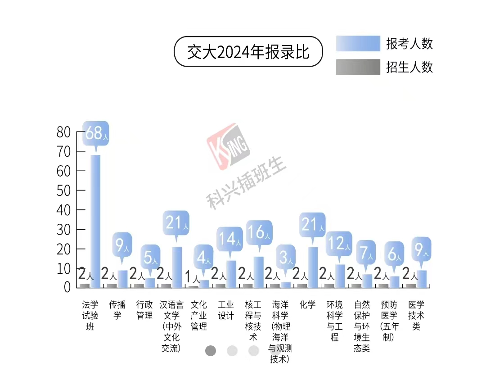
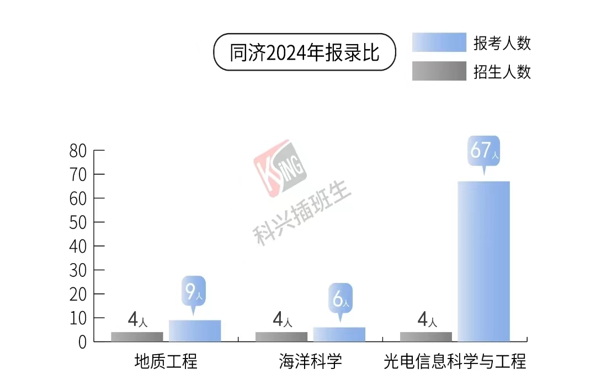
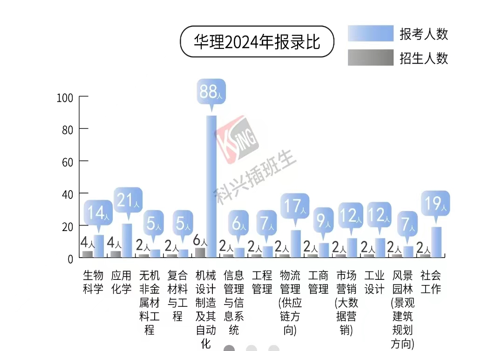
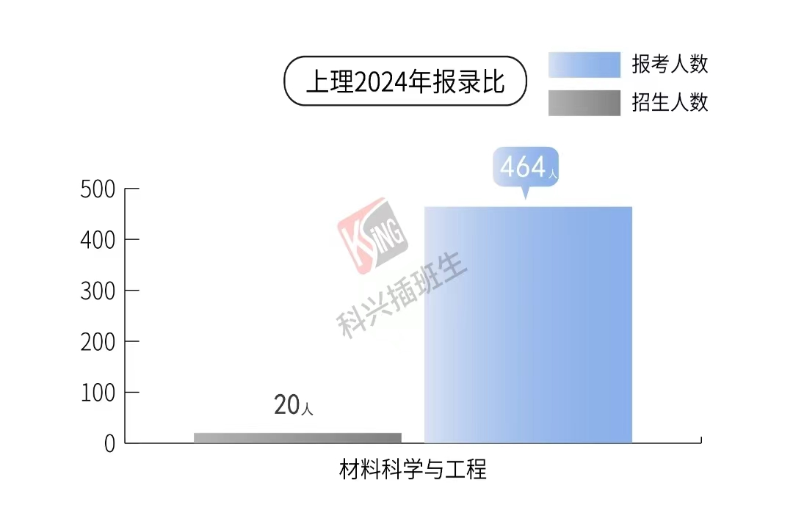

# 关于插班生

from 猫柒

## 什么是插班生

上海特有的大学政策，普通本科大学生大一下学期五月份的时候可以参加由上海统一组织的插班生考试，考上了就能直接把学籍从原学校换到新学校，跟你高考直接考上新学校没有区别，和专升本不同，不会留下原学校“案底”。没考上就继续在原来学校继续读，是一种弥补高考遗憾的方式。

## 插班生报考条件

不同学校的要求不同，具体的需要自己去查招生简章，基本上都要求绩点大于80%，换成上电的绩点需要3.3以上，注意同济要85%，我们班只有一个要考同济插班生，结果因为绩点不够报名都失败了()。

## 插班生考什么

插班生考试类似考研，考2-3门课，不同学校考的科目不太一样，但是都要考高数和英语。不同学校考试难度也不太一样，92学校的数学近似于考研难度，英语在四级到六级到考研难度不等，像海洋海事上理这种双非就是本校期末考试水平了。我记得上大这种是要根据报考专业不同而考对应的其他科目的，比如机械专业要考物理，具体的需要查看对应学校的招生简章。

## 参加插班生考试的学校
复旦大学、上海交通大学、同济大学、华东师范大学、华东理工大学、东华大学、上海理工大学、上海海事大学、华东政法大学、上海海洋大学、上海大学、上海政法学院、上海师范大学、上海立信会计金融学院。
对，上电不招收插班生。

## 插班生难度

个人感觉高于转专业去电气，大于等于考公，毕竟校内高数考个90并不算难于登天，但大一自学考研题目还要和几百人竞争十几个名额要考虑的可就多了。理工科专业基本都是几十几百个人对应十几个招生名额，贴几个学校的图参考，其他的网上都找的到。

## 如何看待插班生

插班生好处网上机构都给说完了，知乎上搜一下就能看见。这是学生共建的入学手册，所以说点机构不说的。

1.插班生和转专业是一种性质的东西，只是一种可能性，而不是必然的道路。就好像不能以转专业去电气为目的而勉强报考上电“垃圾”专业一样，也不能觉得上海有插班生政策可以插到复交而报考性价比极低的上海学校。
2.插班生和转专业和中高考不一样，不是必经之路，更不能让你“逆天改命”，只是大学额外的dlc，转专业一个班可能只有三四个，插班生一个学院可能也就十几个要考，一个上岸。
3.插班生学校给的专业也不算很好，偶有好专业则竞争人数很多，个人感觉专业略大于学校，比如从上电计算机考到华理的社会工作，是不值的；华师有软件工程这种好一些的工科，竞争人数很多，难度很大，我有个朋友就要考这个失败了()。
4.个人认为插班生只适合高考发挥失利很大，真正实力很强的人考，感觉现在这个学校不理想，或者报志愿报错了之类的正常高考进来的不建议考，还不如复读来的可能性大一点。转专业同理，只不过转专业可能性大一些，但是当前这个专业能不能接受，难道不是报的时候就应该考虑好的事吗?倘若说是家长报的没有征求自己的意见，更应该反思自己，而不是急着想把洞补上，把握住已有的才是理智的选择。
5.插班生形式上类似于不太正规的考研，科目是这样，录取也是这样，多少留着大人的操作空间。

## 小心骗子

不管是群里有人主动加你还是网上自己搜着看的，插班生这个东西是有机构在宣传的，有一些话术说“无风险的二次高考” “考不上对考研也有帮助” “如果你想提升院校档次不建议，但是如果你想锻炼自己就……”，看到这些都要警惕，机构们在网上是会有水军在对线忽悠你的，说了这些基本都是恰了米的，要有自己的判断。要报课就那两家大机构，下面小的更是纯纯的骗钱。

无风险，指的是5000报他那个数学英语课吗？其他四六级口语，绘画，编程课同理。想自己网上报课建议先上一年大学开阔一下眼界。
